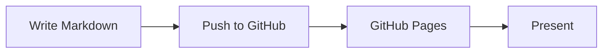
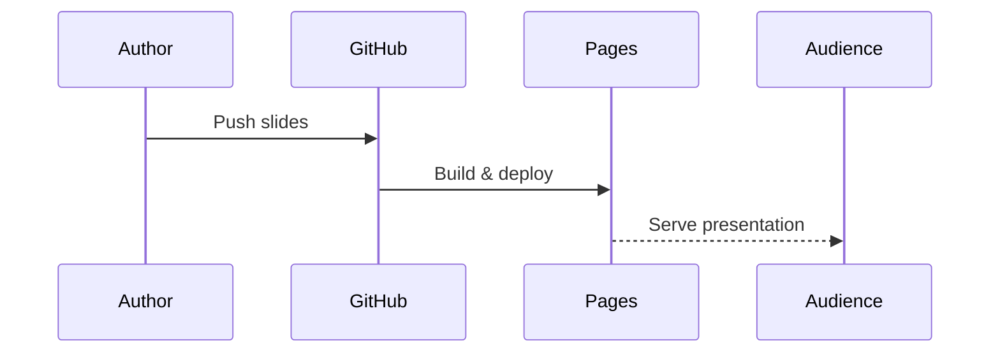

# Welcome to Your Slides

A Reveal.js + Markdown setup for GitHub Pages

---

## How It Works

- Write your slides in Markdown
- Separate slides with `---`
- Push to GitHub and present from anywhere

Note: These are speaker notes. Press **S** to open the speaker view.

---

## Vertical Slides

Use `--` to create vertical (nested) slides

--

### Like This One

Swipe down or press the down arrow to navigate vertical slides.

---

## Code Highlighting

```python
def hello(name):
    """Greet someone properly."""
    return f"Hello, {name}!"
```

Reveal.js highlights code blocks automatically.

---

## Fragment Animations

- This appears first <!-- .element: class="fragment" -->
- Then this <!-- .element: class="fragment" -->
- And finally this <!-- .element: class="fragment" -->

---

## Images

Use standard Markdown image syntax:


---

## Diagrams with Mermaid



--

### More diagram types



---

## Themes

Swap the CSS link in your deck's HTML file.

Custom themes: `clean`, `dark` — or create your own.

---

## That's It

Edit this file, push to GitHub, present from your browser.

No build step. No dependencies. Just Markdown.
